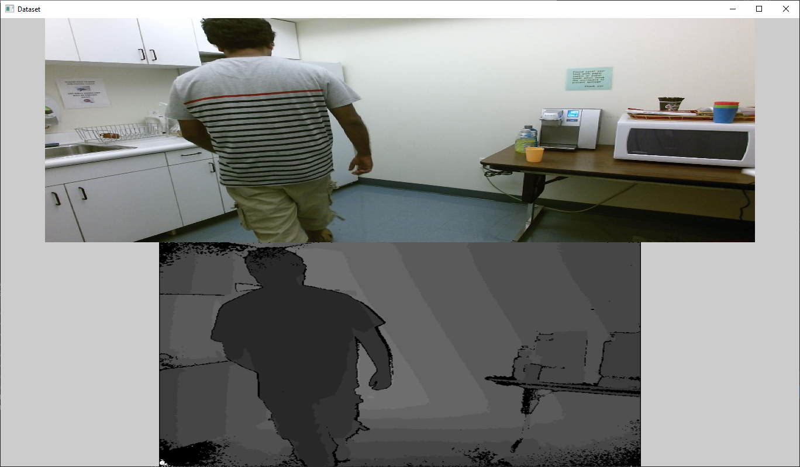

# Occlusion
What happens if images are occluded by robots?

## Dependencies

* [glad](https://glad.dav1d.de/) - OpenGL
```
lib\glad\glad.c(h), lib\KHR\khrplatform.h
```

* [glfw](https://www.glfw.org/) - OpenGL window management
  * In Property Pages
    * C/C++ -> General, Additional Include Directories, put your *eigenroot*
  * Build glfw3.lib and locate at
```
lib
```

* [stb_image](https://github.com/nothings/stb/blob/master/stb_image.h) - png, jpg loader
```
lib\stb\stb_image.h
```

* [tinyxml2](http://www.grinninglizard.com/tinyxml2/index.html) - xml loader
```
lib\tinyxml2\tinyxml2.h(cpp)
```

* [Eigen](http://eigen.tuxfamily.org/index.php?title=Main_Page) - Math library
  * In Property Pages
    * C/C++ -> General, Additional Include Directories, put your *eigenroot*

* Mablab 2019a
  * In Property Pages, replace *matlibroot* with the actual directory
    * Debugging, Environment, put your *PATH=matlibroot\bin\win64;%PATH%*
    * C/C++ -> General, Additional Include Directories, put your *matlibroot\extern\include*
    * Linker -> General, Additional Library Directories, put your *matlibroot\extern\lib\win64\microsoft*

## Vision Dataset

* [UTKinect](http://cvrc.ece.utexas.edu/KinectDatasets/HOJ3D.html) dataset
```
data\utkinect
```

* [Watch-n-Patch](http://watchnpatch.cs.cornell.edu/) dataset
```
data\watch-n-patch
```

## Robot Data

* [Fetch robot description](https://github.com/fetchrobotics/fetch_ros/tree/indigo-devel)
  * Clone it in any place outside the project directory
  * Put the *fetch_ros* path to where *RobotModelLoader* class initializes

## Sample Image


